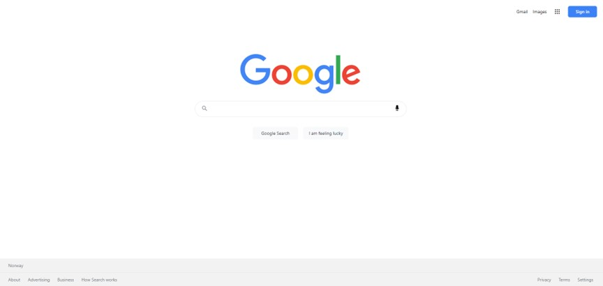

# Project Description

This project is a clone of Google, a web application that allows users to search the web and images using the Google Custom Search API. It provides search results for both web pages and images, with pagination functionality. Users can also perform a random search using a randomly generated word.

## How it Works

The project mimics the functionality of Google's search engine:

1. **Search Functionality:** Users can enter their search query in the provided search bar. Upon submission, the application fetches search results from the Google Custom Search API based on the provided search parameters.

2. **Web Search Results:** The application displays search results for web pages, including the title, URL, and snippet of each result. Pagination buttons allow users to navigate through multiple pages of search results.

3. **Image Search Results:** Similarly, the application displays search results for images, including the image itself, title, and source URL. Pagination buttons are provided for navigating through multiple pages of image results.

4. **Random Search:** Users have the option to perform a random search by clicking the "I am feeling lucky" button. This feature generates a random word using an external API and redirects users to the search results page for that word.

## Components

The project consists of several components:

- **HomeSearch:** Provides the search form where users can input their search query. It includes options for performing a standard Google search or a random search.

- **WebSearchPage and ImageSearchPage:** Fetch search results from the Google Custom Search API based on the provided search parameters. They display the results using the respective result components (WebSearchResults and ImageSearchResults).

- **WebSearchResults and ImageSearchResults:** Render the search results for web pages and images, respectively. They display the search information and iterate over the search results, displaying each result's details.

- **PaginationButtons:** Provides pagination functionality for navigating through search results.

## Additional Components

- **Link Component:** Imported from the Next.js library and used for navigation within the application.

- **Parser Component:** Imported from the html-react-parser library and used to parse HTML snippets in the search results.

- **Icons:** Imported from the react-icons library and used for visual elements like search and pagination buttons.

## Conclusion

While this project is not affiliated with Google, it replicates the core functionality and user experience of the Google search engine, allowing users to search the web and images with ease.
